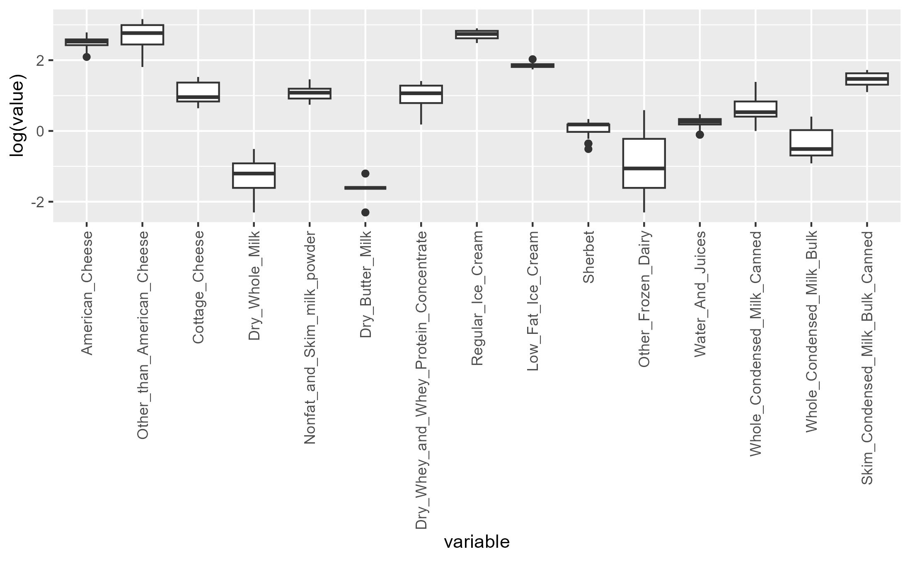
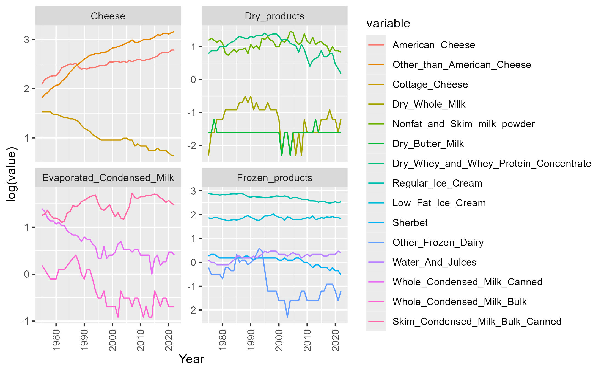
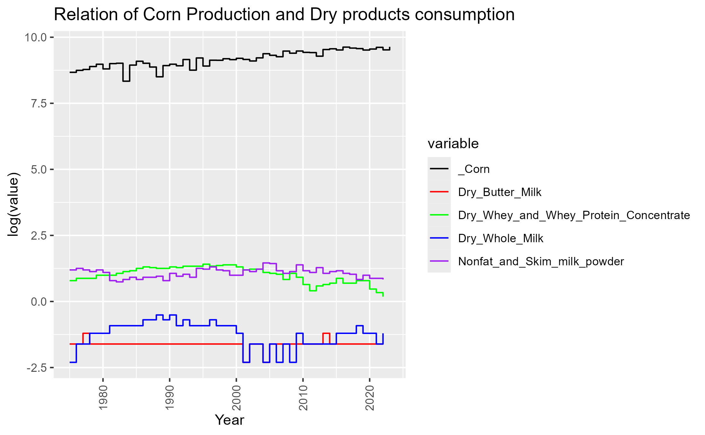
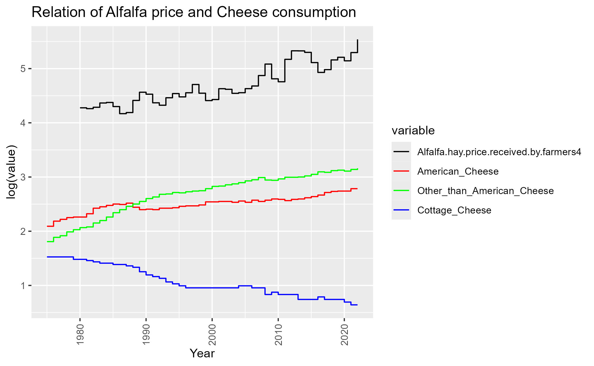
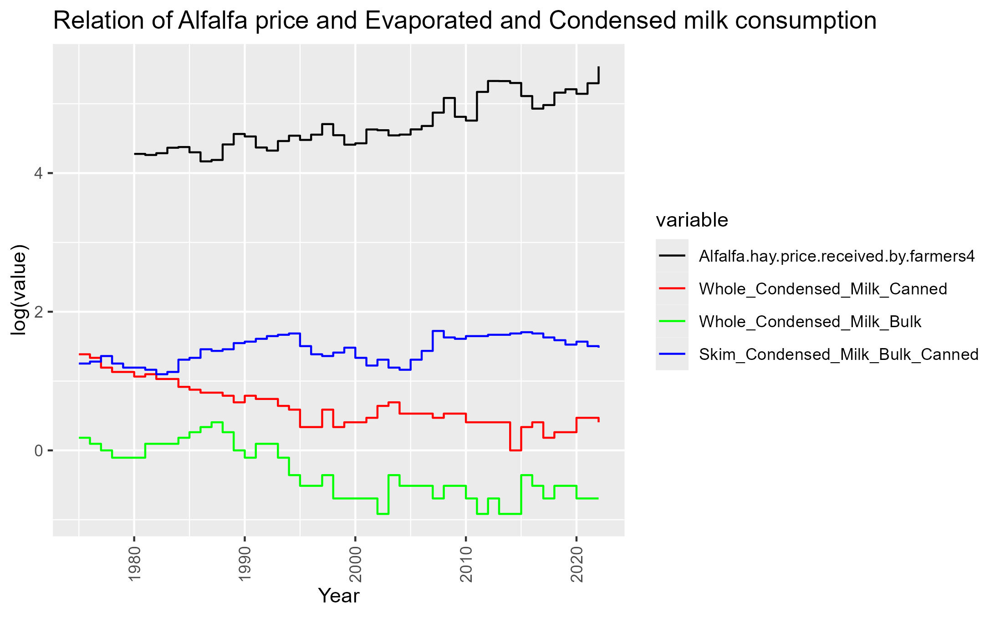
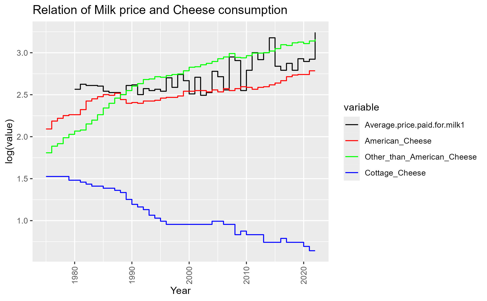
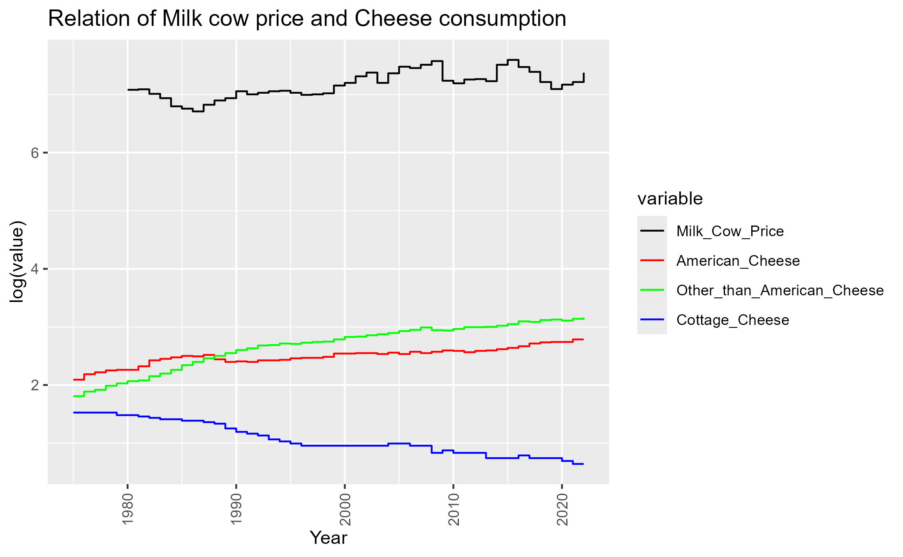
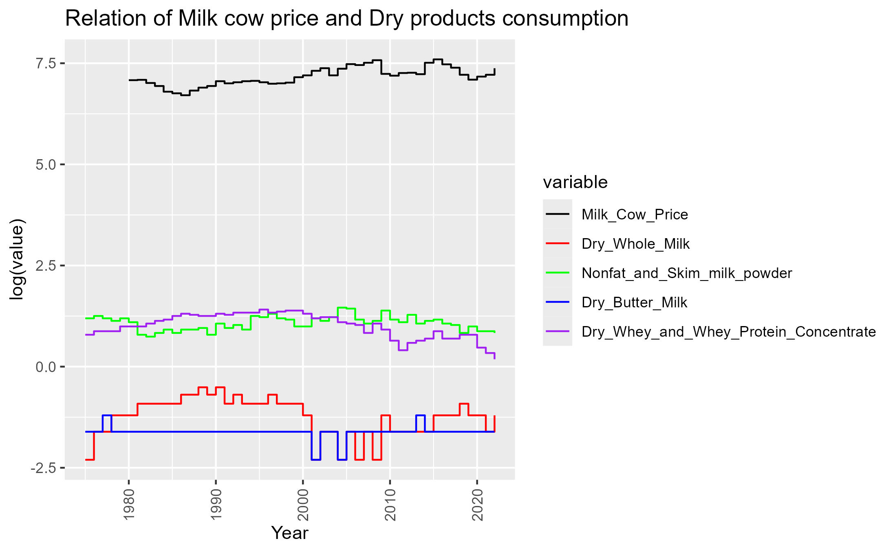
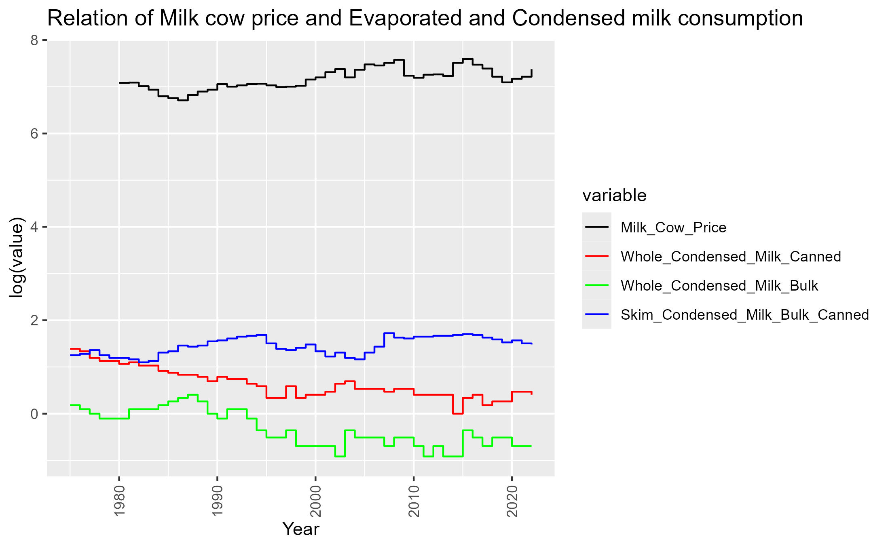

# Analysis of trends in Dairy Consumption in the United States

#### Aidan Bobholz and Gavin Anderson

## Introduction

This project aims to explore data sets around the Dairy Industry better to understand trends in the usage of dairy commodities. As with most agricultural markets, notable events have occurred that caused massive changes in the usage of agricultural commodities. Analysis of this topic can give us, as students in agriculture, a better insight into how the dairy market is affected. Our end goal is to identify the major trends in dairy commodity usage and find reasons that may be attributed to the increased or decreased usage.

To follow this goal we will explore further into these questions:

1.  What is the most consumed dairy commodity?

2.  What are the trends in consumption of dairy products?

3.  Does corn production trends follow the trends of dairy consumption?

4.  Does the sale price of Alfalfa production effect dairy consumption?

5.  How does Average price paid for milk effect dairy consumption?

6.  Does milk cow costs have an effect on dairy consumption?

## Data

### Structure

The link to our datasets can be found at <https://www.ers.usda.gov/data-products/dairy-data.aspx>. We are using the "Dairy products: Per capita consumption, United States (Annual)" as our primary dataset and will have additional datasets added to compare trends in corn production and the Annual milk production and factors affecting supply (Annual).

### Cleaning

First, we needed to manually format the source datasheets in cleaning the data frames. The USDA had formatted the datasheets so that tidyverse would have a more challenging time getting them formatted to use than it would take for us to edit them manually. In editing them, we formatted them so there were column headers with descriptive names of their values. This process was completed for all three datasheets used.

After manually cleaning the data frames, we imported them into our Rmarkdown file; the first step was removing all NA instances from the dataset. In this, we removed two columns in the primary dataset that contained NA values along with the Milk_fat_basis, which was not too significant for data analysis.

``` r
dataset <- dataset %>% select(-one_of('Skim_solids_basis ', 'Frozen_Yougurt ', 'Milk_fat_basis '))
```

After this step, we melted the data frame to make creating visuals of the data easier.

``` r

melted_data <- melt(dataset, id.vars = "Year")
```

Melting the data frame creates a dataset with three columns and variables: Year, variable, and value. Doing this helps make it easier to create graphs and other visuals. And goes into the last step was adding the variable of category, which represents the category into which the dairy commodity falls.

``` r

#Creating catgories based on the variable identifier

categorize <- function(variable_name) {
  if (grepl("American_Cheese", variable_name, ignore.case = TRUE)) {
    return("Cheese")
  } else if (grepl("Other_than_American_Cheese", variable_name, ignore.case = TRUE)) {
    return("Cheese")
  } else if (grepl("Cottage_Cheese", variable_name, ignore.case = TRUE)) {
    return("Cheese")
  } else if (grepl("Dry_Whole_Milk", variable_name, ignore.case = TRUE)) {
    return("Dry_products")
  } else if (grepl("Nonfat_and_Skim_milk_powder", variable_name, ignore.case = TRUE)) {
    return("Dry_products")
  } else if (grepl("Dry_Butter_Milk", variable_name, ignore.case = TRUE)) {
    return("Dry_products")
  } else if (grepl("Dry_Whey_and_Whey_Protein_Concentrate", variable_name, ignore.case = TRUE)) {
    return("Dry_products")
  } else if (grepl("Regular_Ice_Cream", variable_name, ignore.case = TRUE)) {
    return("Frozen_products")
  } else if (grepl("Low_Fat_Ice_Cream", variable_name, ignore.case = TRUE)) {
    return("Frozen_products")
  } else if (grepl("Sherbet", variable_name, ignore.case = TRUE)) {
    return("Frozen_products")
  } else if (grepl("Other_Frozen_Dairy", variable_name, ignore.case = TRUE)) {
    return("Frozen_products")
  } else if (grepl("Water_And_Juices", variable_name, ignore.case = TRUE)) {
    return("Frozen_products")
  } else if (grepl("Whole_Condensed_Milk_Canned", variable_name, ignore.case = TRUE)) {
    return("Evaporated_Condensed_Milk")
  } else if (grepl("Whole_Condensed_Milk_Bulk", variable_name, ignore.case = TRUE)) {
    return("Evaporated_Condensed_Milk")
  } else if (grepl("Skim_Condensed_Milk_Bulk_Canned", variable_name, ignore.case = TRUE)) {
    return("Evaporated_Condensed_Milk")
  } else {
    return("Other")
  }
}

melted_data$Category <- sapply(melted_data$variable, categorize)

head(melted_data)
```

After following these cleaning steps for the primary data frame, we can use the dataset to answer our questions.

The following cleaning is for the dataset, which has values that may affect commodity consumption in the United States.

``` r

dataset_effect <- subset(dataset_effect, select = c(Year, Alfalfa.hay.price.received.by.farmers4, Average.price.paid.for.milk1, Milk_Cow_Price))

dataset_effect$Milk_Cow_Price <- as.numeric(gsub(",", "", dataset_effect$Milk_Cow_Price))
```

For this dataset, the first step was to get it to contain only the variables of interest for comparison. These variables are Year, Alfalfa price, Average milk price, and Milk Cow price. We also had to convert Milk_Cow_Price into a numeric variable as it stated that it was a character. Next up is to melt the dataset so it is easier to use.

``` r

melted_data_effect <- melt(dataset_effect, id.vars = "Year")
```

This dataset is now ready to be used. We will merge this dataset with the subcategory sets of the primary dataset in these next steps. The subcategories are cheese, dry products, evaporated and condensed milk, and frozen products.

``` r

melted_data_cheese <- melted_data %>% 
  filter(melted_data$Category == "Cheese")

melted_data_dry_products <- melted_data %>% 
  filter(melted_data$Category == "Dry_products")

melted_data_Evaporated_Condensed_Milk <- melted_data %>% 
  filter(melted_data$Category == "Evaporated_Condensed_Milk")

melted_data_Frozen_products <- melted_data %>% 
  filter(melted_data$Category == "Frozen_products")
```

Now with these data frames, we can remove the category column from them, merge them with the effects dataset, and create visuals for comparing commodity consumption and the variables observed from the impact dataset.

``` r

#Removal of Category
melted_data_cheese <- melted_data_cheese %>% select(-one_of('Category'))
melted_data_dry_products <- melted_data_dry_products %>% select(-one_of('Category'))
melted_data_Evaporated_Condensed_Milk <- melted_data_Evaporated_Condensed_Milk %>% select(-one_of('Category'))
melted_data_Frozen_products <- melted_data_Frozen_products %>% select(-one_of('Category'))

#Variable specific dataframe of effect

alfalfa_price <- melted_data_effect %>% 
  filter(melted_data_effect$variable == "Alfalfa.hay.price.received.by.farmers4")
milk_price <- melted_data_effect %>% 
  filter(melted_data_effect$variable == "Average.price.paid.for.milk1")
milk_cow <- melted_data_effect %>% 
  filter(melted_data_effect$variable == "Milk_Cow_Price")

#Creation of sub dataframes for visualization of relations

alfalfa_cheese <- bind_rows(alfalfa_price, melted_data_cheese)
alfalfa_dry <- bind_rows(alfalfa_price, melted_data_dry_products)
alfalfa_evaporated <- bind_rows(alfalfa_price, melted_data_Evaporated_Condensed_Milk)
alfalfa_frozen <- bind_rows(alfalfa_price, melted_data_Frozen_products)

milk_price_cheese <- bind_rows(milk_price, melted_data_cheese)
milk_price_dry <- bind_rows(milk_price, melted_data_dry_products)
milk_price_evaporated <- bind_rows(milk_price, melted_data_Evaporated_Condensed_Milk)
milk_price_frozen <- bind_rows(milk_price, melted_data_Frozen_products)

milk_cow_cheese <- bind_rows(milk_cow, melted_data_cheese)
milk_cow_dry <- bind_rows(milk_cow, melted_data_dry_products)
milk_cow_evaporated <- bind_rows(milk_cow, melted_data_Evaporated_Condensed_Milk)
milk_cow_frozen <- bind_rows(milk_cow, melted_data_Frozen_products)
```

The last set of cleaning now is the corn production dataset. This dataset was pulled from the USDA database. Initial editing was done in Excel to format to explore in R. The first step for this dataset was to rename the column headers to understand what each variable meant.

``` r

NewNames <- c("variable","Year","Planted.Acres","Harvested.Acres","value","Yield","Farm.Price","1","2")

names(HGP) <- NewNames
```

After this, we began to look at the variables and made sure they were in the correct formatting, i.e., numerical factors were indeed numerical, and dates were formatted correctly.

``` r

HGP = subset(HGP, select = -c(3,4,6,7,8,9) )

HGP$Year <- gsub("/.*", "", HGP$Year)

HGP = filter(HGP, Year > 1974)

HGP = filter(HGP, variable == 'Corn')

HGP$Year <- as.numeric(substring(HGP$Year, 1, 4))
HGP$value <- as.numeric(gsub(",", "", HGP$value))
```

After this reformatting and correcting variables in the dataset, we were ready to merge the dataset with our main dataset to begin getting visuals to help us answer our questions.

``` r

Corn.Production = bind_rows(HGP, melted_data)
```

### Variables

-   Year: The year in which the data point was collected.
-   American_Cheese: The amount of American cheese consumed in the U.S. per capita.
-   Other_than_American_Cheese: The amount of cheese other than American cheese consumed in the U.S. per capita.
-   Cottage_Cheese: The amount of Cottage cheese consumed in the U.S. per capita.
-   Dry_Whole_Milk: The amount of Dry_Whole_Milk consumed in the U.S. per capita.
-   Nonfat_and_Skim_milk_powder: The amount of Nonfat_and_Skim_milk_powder consumed in the U.S. per capita.
-   Dry_Butter_Milk: The amount of Dry_Butter_Milk consumed in the U.S. per capita.
-   Dry_Whey_and_Whey_Protein_Concentrate: The amount of Dry_Whey_and_Whey_Protein_Concentrate consumed in the U.S. per capita.
-   Regular_Ice_Cream: The amount of Regular_Ice_Cream consumed in the U.S. per capita.
-   Low_Fat_Ice_Cream: The amount of Low_Fat_Ice_Cream consumed in the U.S. per capita.
-   Sherbet: The amount of Sherbet consumed in the U.S. per capita.
-   Other_Frozen_Dairy: The amount of Other_Frozen_Dairy consumed in the U.S. per capita.
-   Water_And_Juices: The amount of Water_And_Juices consumed in the U.S. per capita.
-   Whole_Condensed_Milk_Canned: The amount of Whole_Condensed_Milk_Canned consumed in the U.S. per capita.
-   Whole_Condensed_Milk_Bulk: The amount of Whole_Condensed_Milk_Bulk consumed in the U.S. per capita.
-   Skim_Condensed_Milk_Bulk_Canned: The amount of Skim_Condensed_Milk_Bulk_Canned consumed in the U.S. per capita.
-   Alfalfa.hay.price.received.by.farmers4: The average price of alfalfa hay paid for a farmer by the year.
-   Average.price.paid.for.milk1: Average price of milk by year in the United States.
-   Milk_Cow_Price: The average cost of a milk cow in the United States.
-   Corn: The total production in millions of bushels of corn in the United States.

## Results

#### What is the most consumed dairy commodity?

``` r

ggplot(filtered_data, aes(x = variable, y = log(value))) +
  geom_boxplot()+
  theme(axis.text.x = element_text(angle = 90, hjust = 1, vjust = 0.5))
ggsave("sales_counts.jpeg")
```



The most consumed dairy commodity in this data set is "Other than American Cheese" which includes: All cheeses other than American cheese. This makes a lot of sense as when you look at a lot of dairy products in stores many of them revolve around cheese. Some examples I think of are as simple as shredded cheese and cheese its.

#### What are the trends in consumption of dairy products?

``` r

ggplot(filtered_data, aes(x = Year, y = log(value), color = variable)) +
  geom_line() +
  theme(axis.text.x = element_text(angle = 90, hjust = 1, vjust = 0.5)) +
  facet_wrap(~ Category, scales = "free_y")
ggsave("trends_facet.jpeg")
```



Overall, most commodity groups of dairy products have been trending down overtime, while the cheese commodity group has been increasing overtime. Which again had showed up in the most consumed product. Also t take into account is in the recent 10 years dairy alternative products have gained popularity. However, it is harder to do so for the cheeses, which can also account for decreased consumption for the three other categories.

#### Does corn production trends follow the trends of dairy consumption?

```r
#Merging datasets

Corn.Production = bind_rows(HGP, melted_data)

Corn_Production_Cheese <- bind_rows(HGP, melted_data_cheese)
Corn_Production_Dry <- bind_rows(HGP, melted_data_dry_products)
Corn_Production_Evaporated <- bind_rows(HGP, melted_data_Evaporated_Condensed_Milk)
Corn_Production_Frozen <- bind_rows(HGP, melted_data_Frozen_products)
```

```r
#Creating graphs for Corn Production
ggplot(Corn_Production_Cheese, aes(x = Year, y = log(value) , color = variable)) +
  geom_step()+
  theme(axis.text.x = element_text(angle = 90, hjust = 1, vjust = 0.5))+
  labs(title = "Relation of Corn Production and Cheese consumption")
ggsave("Corn_Production_Cheese.jpeg")

ggplot(Corn_Production_Dry, aes(x = Year, y = log(value) , color = variable)) +
  geom_step()+
  theme(axis.text.x = element_text(angle = 90, hjust = 1, vjust = 0.5))+
  labs(title = "Relation of Corn Production and Dry products consumption")
ggsave("Corn_Production_Dry.jpeg")

ggplot(Corn_Production_Evaporated, aes(x = Year, y = log(value) , color = variable)) +
  geom_step()+
  theme(axis.text.x = element_text(angle = 90, hjust = 1, vjust = 0.5))+
  labs(title = "Relation of Corn Production and Evaporated and Condensed milk consumption")
ggsave("Corn_Production_Evaporated.jpeg")

ggplot(Corn_Production_Frozen, aes(x = Year, y = log(value) , color = variable)) +
  geom_step()+
  theme(axis.text.x = element_text(angle = 90, hjust = 1, vjust = 0.5))+
  labs(title = "Relation of Corn Production and Frozen products consumption")
ggsave("Corn_Production_Frozen.jpeg")
```





Total corn production does not appear to effect any dairy products in any significant way. Corn production grew slowly and linearly while dairy product consumption was very volatile. There was a few minor dips, the biggest being the farm crisis of the 80's, however these did not seem to effect consumer behavior.

#### Does the sale price of Alfalfa production effect dairy consumption?

``` r

ggplot(alfalfa_cheese, aes(x = Year, y = log(value) , color = variable)) +
  geom_step()+
  theme(axis.text.x = element_text(angle = 90, hjust = 1, vjust = 0.5))+
  labs(title = "Relation of Alfalfa price and Cheese consumption")
ggsave("alfalfa_cheese.jpeg")

ggplot(alfalfa_dry, aes(x = Year, y = log(value) , color = variable)) +
  geom_step()+
  theme(axis.text.x = element_text(angle = 90, hjust = 1, vjust = 0.5))+
  labs(title = "Relation of Alfalfa price and Dry products consumption")
ggsave("alfalfa_dry.jpeg")

ggplot(alfalfa_evaporated, aes(x = Year, y = log(value) , color = variable)) +
  geom_step()+
  theme(axis.text.x = element_text(angle = 90, hjust = 1, vjust = 0.5))+
  labs(title = "Relation of Alfalfa price and Evaporated and Condensed milk consumption")
ggsave("alfalfa_evaporated.jpeg")

ggplot(alfalfa_frozen, aes(x = Year, y = log(value) , color = variable)) +
  geom_step()+
  theme(axis.text.x = element_text(angle = 90, hjust = 1, vjust = 0.5))+
  labs(title = "Relation of Alfalfa price and Frozen products consumption")
ggsave("alfalfa_frozen.jpeg")
```







The price of alfalfa does not appear to affect dairy commodities' consumption. In most cases the commodity consumption and alfalfa price do do not follow the same curve, though for cheeses there does appear to be the same grow for the main cheeses and a decay with cottage cheese.

#### How does Average price paid for milk effect dairy consumption?

``` r

ggplot(milk_price_cheese, aes(x = Year, y = log(value) , color = variable)) +
  geom_step()+
  theme(axis.text.x = element_text(angle = 90, hjust = 1, vjust = 0.5))+
  labs(title = "Relation of Milk price and Cheese consumption")
ggsave("milk_price_cheese.jpeg")

ggplot(milk_price_dry, aes(x = Year, y = log(value) , color = variable)) +
  geom_step()+
  theme(axis.text.x = element_text(angle = 90, hjust = 1, vjust = 0.5))+
  labs(title = "Relation of Milk price and Dry products consumption")
ggsave("milk_price_dry.jpeg")

ggplot(milk_price_evaporated, aes(x = Year, y = log(value) , color = variable)) +
  geom_step()+
  theme(axis.text.x = element_text(angle = 90, hjust = 1, vjust = 0.5))+
  labs(title = "Relation of Milk price and Evaporated and Condensed milk consumption")
ggsave("milk_price_evaporated.jpeg")

ggplot(milk_price_frozen, aes(x = Year, y = log(value) , color = variable)) +
  geom_step()+
  theme(axis.text.x = element_text(angle = 90, hjust = 1, vjust = 0.5))+
  labs(title = "Relation of Milk price and Frozen products consumption")
ggsave("milk_price_frozen.jpeg")
```




Milk price and evaporated/ condensed milk appear to have some relations with milk price and dry products. Milk powder and whey powder appear to have an antagonistic relationship. For the condensed milks they appear to also have an antagonistic relationship. The decrease in these commodities consumption does make sense as if milk prices are increased the cost of a product is likely to increase causing a decrease in the consumption of the product since people can not buy as much of the product.

#### Does milk cow costs have an effect on dairy consumption?

``` r

ggplot(milk_cow_cheese, aes(x = Year, y = log(value) , color = variable)) +
  geom_step()+
  theme(axis.text.x = element_text(angle = 90, hjust = 1, vjust = 0.5))+
  labs(title = "Relation of Milk cow price and Cheese consumption")
ggsave("milk_cow_cheese.jpeg")

ggplot(milk_cow_dry, aes(x = Year, y = log(value) , color = variable)) +
  geom_step()+
  theme(axis.text.x = element_text(angle = 90, hjust = 1, vjust = 0.5))+
  labs(title = "Relation of Milk cow price and Dry products consumption")
ggsave("milk_cow_dry.jpeg")

ggplot(milk_cow_evaporated, aes(x = Year, y = log(value) , color = variable)) +
  geom_step()+
  theme(axis.text.x = element_text(angle = 90, hjust = 1, vjust = 0.5))+
  labs(title = "Relation of Milk cow price and Evaporated and Condensed milk consumption")
ggsave("milk_cow_evaporated.jpeg")

ggplot(milk_cow_frozen, aes(x = Year, y = log(value) , color = variable)) +
  geom_step()+
  theme(axis.text.x = element_text(angle = 90, hjust = 1, vjust = 0.5))+
  labs(title = "Relation of Milk cow price and Frozen products consumption")
ggsave("milk_cow_frozen.jpeg")
```








The price of a milk cow does not appear to me a direct effecting agent on the consumption of dairy commodities. Milk cow price having no affect is likely also because the price has not significantly changed over time and the milk supply will not change depending on the price of the calves.

## Conclusion

Going through this dataset was a fun experience and great for learning how to work through a dataset to solve questions that arise for certain topics. From this analysis we have learned about some relations of external events in agriculture that can either effect or not effect the consumption of dairy products in the United States.

Further research can be conducted on this by adding more industry events and markets that may impact the consumption of dairy products. This information is useful for those who are in the agricuture trading markets as they may be able to easier watch the trends of certain products and predict what the demand for dairy commodities may be. Correlation markets can be useful for companies looking to increase their profits and to help with sustainibility in agricuture by reducing food waste of products unsold.
