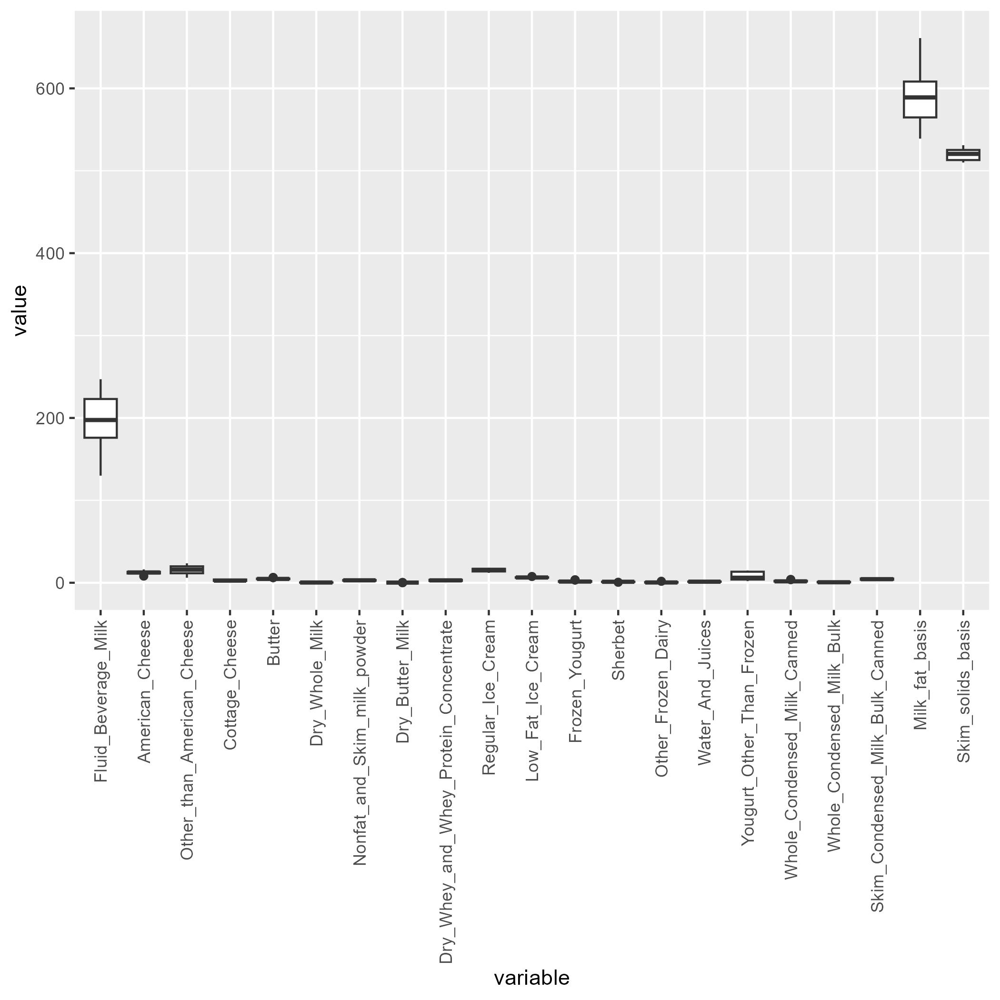
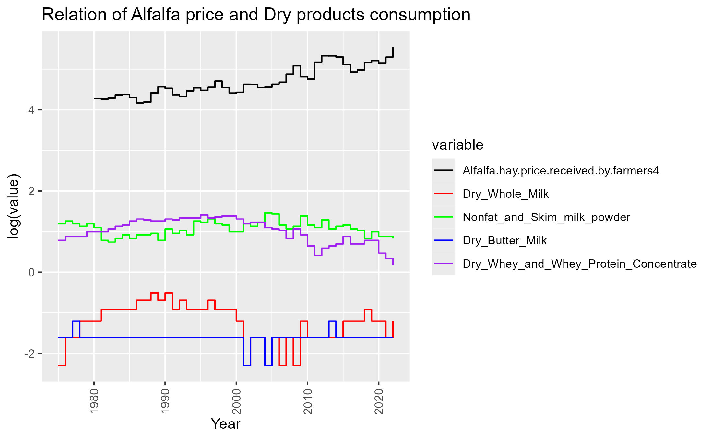
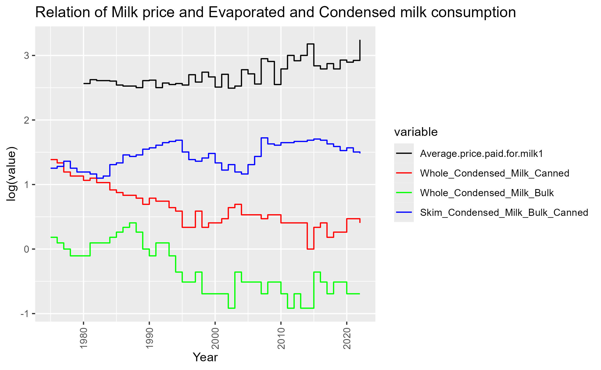
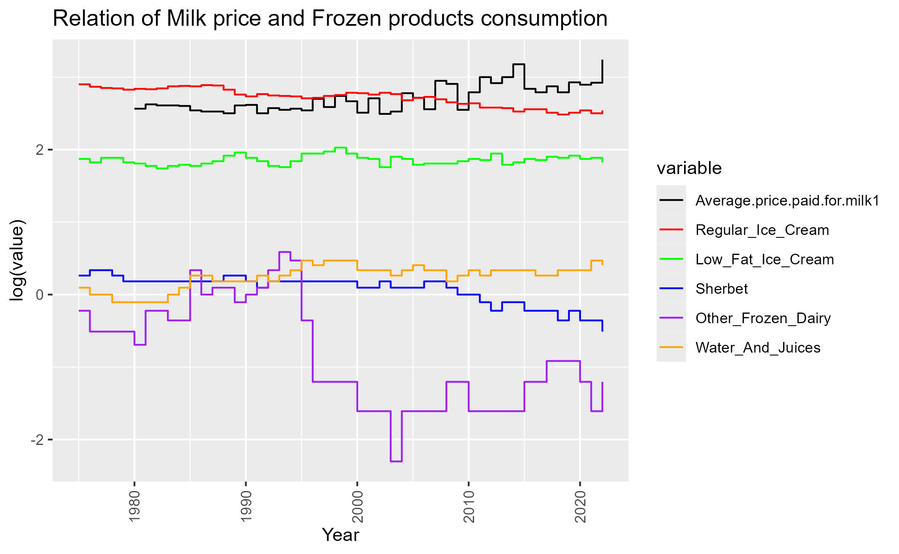
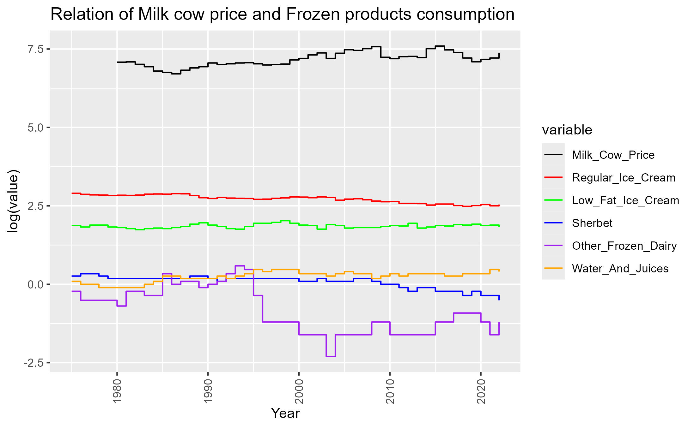

# Analysis of trends in Dairy Consumption in the United States

#### Aidan Bobholz and Gavin Anderson

## Introduction

The goal of this project is to explore data sets around the Dairy Industry to better understand trends in the usage of dairy commodities. As with most agricultural markets there have been notable events that occur in which cause massive changes in the usage of agricultural commodities. Analysis on this topic can give us as students in agriculture a better insight into the ways in which the dairy market is effected. Our end goal is to identify the major trends in dairy commodity usages and find reasons that may be attributed to the increased or decreased usages.

To follow this goal we will explore further into these questions:

1.  What is the most consumed dairy commodity?

2.  What are the trends in consumption of dairy products?

3.  Does corn production trends follow the trends of dairy consumption?

4.  Does the sale price of Alfalfa production effect dairy consumption?

5.  How does Average price paid for milk effect dairy consumption?

6.  Does milk cow costs have an effect on dairy consumption?

## Data

### Structure

The link to our datasets can be found at <https://www.ers.usda.gov/data-products/dairy-data.aspx>. We are using the "Dairy products: Per capita consumption, United States (Annual)" as our major dataset and will have additional datasets added to compare trends in; corn production and the Annual milk production and factors affecting supply (Annual).

### Cleaning

First in cleaning the data frames we needed to manual format the source datasheets. The USDA had formatted the datasheets in a way that tidyverse would have a harder time getting them formatted to use than it would take for us to manual edit them. In editing them we formatted it so that there was column headers with descriptive names of their values. This was done for all three datasheets used.

After this manual cleaning of the data frames we had then imported them into our Rmarkdown file, the first step was to remove all NA instances from the dataset. In this we had removed two columns in the main dataset that conatined NA values along with Milk_fat_basis which was not to significance for data analysis.

``` r
dataset <- dataset %>% select(-one_of('Skim_solids_basis ', 'Frozen_Yougurt ', 'Milk_fat_basis '))
```

After this step we had melted the dataframe to make it easier to create visuals of the data.

``` r

melted_data <- melt(dataset, id.vars = "Year")
```

Melting the data frame creates a dataset with three columns and variables as Year, variable, and value. Doing this helps make it easier to create graphs and other visuals. And goes into the last step which was adding the variable of category which represents the category in which the dairy commodity falls into.

``` r

#Creating catgories based on the variable identifier

categorize <- function(variable_name) {
  if (grepl("American_Cheese", variable_name, ignore.case = TRUE)) {
    return("Cheese")
  } else if (grepl("Other_than_American_Cheese", variable_name, ignore.case = TRUE)) {
    return("Cheese")
  } else if (grepl("Cottage_Cheese", variable_name, ignore.case = TRUE)) {
    return("Cheese")
  } else if (grepl("Dry_Whole_Milk", variable_name, ignore.case = TRUE)) {
    return("Dry_products")
  } else if (grepl("Nonfat_and_Skim_milk_powder", variable_name, ignore.case = TRUE)) {
    return("Dry_products")
  } else if (grepl("Dry_Butter_Milk", variable_name, ignore.case = TRUE)) {
    return("Dry_products")
  } else if (grepl("Dry_Whey_and_Whey_Protein_Concentrate", variable_name, ignore.case = TRUE)) {
    return("Dry_products")
  } else if (grepl("Regular_Ice_Cream", variable_name, ignore.case = TRUE)) {
    return("Frozen_products")
  } else if (grepl("Low_Fat_Ice_Cream", variable_name, ignore.case = TRUE)) {
    return("Frozen_products")
  } else if (grepl("Sherbet", variable_name, ignore.case = TRUE)) {
    return("Frozen_products")
  } else if (grepl("Other_Frozen_Dairy", variable_name, ignore.case = TRUE)) {
    return("Frozen_products")
  } else if (grepl("Water_And_Juices", variable_name, ignore.case = TRUE)) {
    return("Frozen_products")
  } else if (grepl("Whole_Condensed_Milk_Canned", variable_name, ignore.case = TRUE)) {
    return("Evaporated_Condensed_Milk")
  } else if (grepl("Whole_Condensed_Milk_Bulk", variable_name, ignore.case = TRUE)) {
    return("Evaporated_Condensed_Milk")
  } else if (grepl("Skim_Condensed_Milk_Bulk_Canned", variable_name, ignore.case = TRUE)) {
    return("Evaporated_Condensed_Milk")
  } else {
    return("Other")
  }
}

melted_data$Category <- sapply(melted_data$variable, categorize)

head(melted_data)
```

After following these cleaning steps for the main dataframe we are ready to use the dataset for answering our quesitons.

The next cleaning is for the dataset which has values that may have an efffect on the commodity consumption in the United States.

``` r

dataset_effect <- subset(dataset_effect, select = c(Year, Alfalfa.hay.price.received.by.farmers4, Average.price.paid.for.milk1, Milk_Cow_Price))

dataset_effect$Milk_Cow_Price <- as.numeric(gsub(",", "", dataset_effect$Milk_Cow_Price))
```

For this dataset the first step was to get it into containg only the variables of interest for comparison. These variables are Year, Alfalfa price, Average milk price, and Milk Cow price. We also had to convert Milk_Cow_Price into a numeric variable as it was stating that it was a character. Next up is to melt the dataset so it is easier to use.

``` r

melted_data_effect <- melt(dataset_effect, id.vars = "Year")
```

This dataset is now ready to be used. We will merge this dataset with the subcatgory sets of the main dataset in these next steps. The subcategories are cheese, dry products, evaporated and condensed milk, and frozen products.

``` r

melted_data_cheese <- melted_data %>% 
  filter(melted_data$Category == "Cheese")

melted_data_dry_products <- melted_data %>% 
  filter(melted_data$Category == "Dry_products")

melted_data_Evaporated_Condensed_Milk <- melted_data %>% 
  filter(melted_data$Category == "Evaporated_Condensed_Milk")

melted_data_Frozen_products <- melted_data %>% 
  filter(melted_data$Category == "Frozen_products")
```

Now with these dataframes we can then remove the category column from them and then merge them with the effects dataset and create visuals for seeing the comparison of commodity consumption and the variabels being observed from the effects dataset.

``` r

#Removal of Category
melted_data_cheese <- melted_data_cheese %>% select(-one_of('Category'))
melted_data_dry_products <- melted_data_dry_products %>% select(-one_of('Category'))
melted_data_Evaporated_Condensed_Milk <- melted_data_Evaporated_Condensed_Milk %>% select(-one_of('Category'))
melted_data_Frozen_products <- melted_data_Frozen_products %>% select(-one_of('Category'))

#Variable specific dataframe of effect

alfalfa_price <- melted_data_effect %>% 
  filter(melted_data_effect$variable == "Alfalfa.hay.price.received.by.farmers4")
milk_price <- melted_data_effect %>% 
  filter(melted_data_effect$variable == "Average.price.paid.for.milk1")
milk_cow <- melted_data_effect %>% 
  filter(melted_data_effect$variable == "Milk_Cow_Price")

#Creation of sub dataframes for visualization of relations

alfalfa_cheese <- bind_rows(alfalfa_price, melted_data_cheese)
alfalfa_dry <- bind_rows(alfalfa_price, melted_data_dry_products)
alfalfa_evaporated <- bind_rows(alfalfa_price, melted_data_Evaporated_Condensed_Milk)
alfalfa_frozen <- bind_rows(alfalfa_price, melted_data_Frozen_products)

milk_price_cheese <- bind_rows(milk_price, melted_data_cheese)
milk_price_dry <- bind_rows(milk_price, melted_data_dry_products)
milk_price_evaporated <- bind_rows(milk_price, melted_data_Evaporated_Condensed_Milk)
milk_price_frozen <- bind_rows(milk_price, melted_data_Frozen_products)

milk_cow_cheese <- bind_rows(milk_cow, melted_data_cheese)
milk_cow_dry <- bind_rows(milk_cow, melted_data_dry_products)
milk_cow_evaporated <- bind_rows(milk_cow, melted_data_Evaporated_Condensed_Milk)
milk_cow_frozen <- bind_rows(milk_cow, melted_data_Frozen_products)
```

The last set of cleaning now is to do with the corn production dataset.

### Variables

-   Year: The year in which the data point was collected.
-   American_Cheese: The amount of American cheese consumed in the U.S. per capita.
-   Other_than_American_Cheese: The amount of cheese other than American cheese consumed in the U.S. per capita.
-   Cottage_Cheese: The amount of Cottage cheese consumed in the U.S. per capita.
-   Dry_Whole_Milk: The amount of Dry_Whole_Milk consumed in the U.S. per capita.
-   Nonfat_and_Skim_milk_powder: The amount of Nonfat_and_Skim_milk_powder consumed in the U.S. per capita.
-   Dry_Butter_Milk: The amount of Dry_Butter_Milk consumed in the U.S. per capita.
-   Dry_Whey_and_Whey_Protein_Concentrate: The amount of Dry_Whey_and_Whey_Protein_Concentrate consumed in the U.S. per capita.
-   Regular_Ice_Cream: The amount of Regular_Ice_Cream consumed in the U.S. per capita.
-   Low_Fat_Ice_Cream: The amount of Low_Fat_Ice_Cream consumed in the U.S. per capita.
-   Sherbet: The amount of Sherbet consumed in the U.S. per capita.
-   Other_Frozen_Dairy: The amount of Other_Frozen_Dairy consumed in the U.S. per capita.
-   Water_And_Juices: The amount of Water_And_Juices consumed in the U.S. per capita.
-   Whole_Condensed_Milk_Canned: The amount of Whole_Condensed_Milk_Canned consumed in the U.S. per capita.
-   Whole_Condensed_Milk_Bulk: The amount of Whole_Condensed_Milk_Bulk consumed in the U.S. per capita.
-   Skim_Condensed_Milk_Bulk_Canned: The amount of Skim_Condensed_Milk_Bulk_Canned consumed in the U.S. per capita.
-   Alfalfa.hay.price.received.by.farmers4: The average price of alfalfa hay paid for a farmer by the year.
-   Average.price.paid.for.milk1: Average price of milk by year in the United States.
-   Milk_Cow_Price: The average cost of a milk cow in the United States.

## Results

#### What is the most consumed dairy commodity?



The most consumed dairy commodity in this data set is "Other than American Cheese" which includes: All cheeses other than American cheese. This makes a lot of sense as when you look at a lot of dairy products in stores many of them revolve around cheese. Some examples I think of are even simple as shredded cheese and even cheese its.

#### What are the trends in consumption of dairy products?


Overall in trends most commodity groups of dairy products have been trending down overtime, while the cheese commodity group has actually been increasing overtime. Which again had showed up in the most consumed product. Also t take into account is in the recent 10 years dairy alternative products have gained popularity, though it is harder to do so for the cheeses, which can also account for the current trend of decreased consumption for the three other categories.

#### Does corn production trends follow the trends of dairy consumption?

Reply\*\*

#### Does the sale price of Alfalfa production effect dairy consumption?





#### 

The price of alfalfa does not appear to effect the consumption of dairy commodities. In most cases the commodity consumption and alfalfa price do do not follow the same curve, though for cheeses there does appear to be the same grow for the main cheeses and a decay with cottage cheese.

#### How does Average price paid for milk effect dairy consumption?


#### 



Milk price and evaporated/ condensed milk appears to have some relations along with milk price and dry products. Milk powder and whey powder appear to have an antagonistic relationship with one another. For the condensed milks they appear to also have an antagonistic relationship. Which this does make sense as for marketing if a product is worth more there is likely less demand for it causing a decrease in the consumption of the product.

#### Does milk cow costs have an effect on dairy consumption?




The price of a milk cow does not appear to me a direct effecting agent on the consumption of dairy commodities. This is likely also due to the fact the price has not significantly change over time and also the supply of milk will not change depending on the price of the calves.

## Conclusion

Going through this dataset was a fun experience and great for learning how to work through a dataset to solve questions that arise for certain topics. From this analysis we have learned about some relations of external events in agriculture that can either effect or not effect the consumption of dairy products in the United States.
